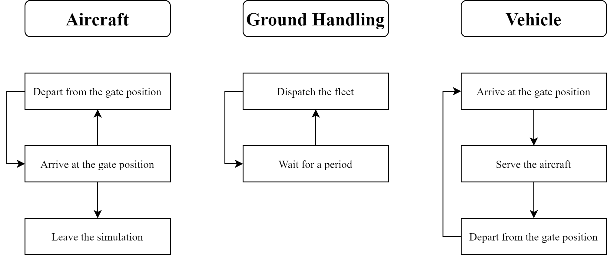
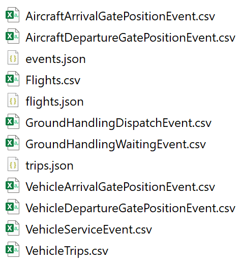

# Aircraft-Ground-Handling-Simulation

## Todo

- Processes design



- the flight without the service of a ground handling vehicle cannot depart from the gate position and then a delay
  occurs.
- the flight without a vehicle to serve cannot arrive at the gate position and then a delay occurs.

### Task1: extend functions of the simulation

- replace the constant with random variable
- implement multiple vehicles

### Task2: determine parameters of the simulation

- the scheduled and real information of flights ✔
- the spatial distribution of gate positions
- the service time of different vehicles
- the fleet size
- the vehicle speed
- the release time of delay information

## How to run a simulation?
- run the below command
```bash
python main.py
```

- then the **output** directory containing several log files will be generated, as following



- among these log files, *Flights.csv* and *VehicleTrips.csv* are the most important, 
- which can be used to analyze the performance of the dispatching algorithm.
